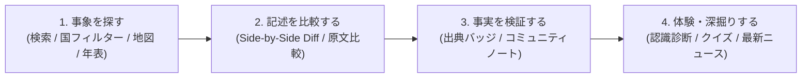

# HistoryDiff 🌍✨

> **国や地域による歴史の「記述の差」を、テキスト比較（Diff）によって視覚的に解明する。**

同じ歴史的事象であっても、教科書に記載される内容や公式な見解は、国や地域によって大きく異なります。**HistoryDiff** は、その「認識の差」をテキストの比較（Diff）を通じて浮き彫りにし、背景の解説や検証ノート、信頼できる参考文献、さらには現代の国際ニュースとの繋がりを示すための双方向的な教育プラットフォームです。

---

### 他の言語で読む:
🌐 **[English](README.md)** | 🇯🇵 **[日本語](README.ja.md)** | 🇨🇳 **[简体中文](README.zh.md)** | 🇰🇷 **[한국어](README.ko.md)**

---

## 🚀 主な機能

### 1. 🔍 高度なテキスト差分ビュアー（Side-by-Side & Inline Diff）
* **リアルタイム比較:** 異なる国や地域の教科書・公式声明をリアルタイムで並べて比較。「追加」「削除」「表現の違い」を文字・単語レベルで視覚的に強調。
* **単語・文単位の原文Diffハイライト（`ClaimDiffInline`）:** 対立する重要語句（例：「固有の領土」vs「不法占拠」など）に対応する原文を自動抽出し、ワンクリックで該当文同士の単語レベルDiffをインライン表示。
* **Sticky視点スイッチャー & モード切替:** スクロール追従するヘッダーでいつでも比較対象国を変更可能。「通常閲覧モード」と「差分比較モード（左右分割 / 統合行）」を即座に切り替え。
* **論争キーワード・独自語の自動抽出:** 各国の教科書にのみ出現する「独自語」や、国ごとの「表現対比・言い換え」を自動分析して提示。

### 2. ⚡ トップページの即時体験と洗練された探索
* **リアルタイムDiffミニデモ:** トップページのファーストビューで、竹島（独島）などの多視点差分を即座に切り替えて体験可能。
* **認識が割れている注目の歴史事象 TOP 3:** 世界で最も認識格差が大きい注目の比較アーカイブを特集表示。
* **ピン留め国フィルター & 多角ビュー:** 主要国（日本、米国、中国、韓国等）をワンクリックで絞り込めるピルボタンとドロップダウンセレクター。グリッド（ミニマルカード）・インタラクティブ世界地図・時系列年表の3つのビューで探索可能。

### 3. 📰 現代の国際情勢との接続（Why This Matters Today）
* **「なぜ今これが重要なのか」:** 過去の歴史的対立が現代の外交・地政学リスクにどう直結しているかを分かりやすく解説。
* **ライブニュースRSSフィード:** 各歴史問題に関連する最新の国際ニュースを自動取得して表示。
* **今後の注目ポイント（Ongoing Watchpoints）:** 進行中の紛争や議論に関する今後のシナリオや焦点となるポイントを明示。

### 4. 🛡️ 信頼性・中立性の担保 & コミュニティ検証
* **中立性宣言バナー:** 特定の立場を擁護・非難せず、公的資料を対等に並置する編集方針を明示。
* **出典の性質バッジ（Source Nature Badges）:** 「政府検定教科書」「政府公式声明」「学術研究」「メディア報道」などの種別と、原典言語か翻訳経由かを視覚的に明記。
* **コミュニティノート & 評価投票:** 客観的なファクトチェック判定（Verdict）と一次資料リンクを提供し、ユーザーが「役に立ったか」を評価できる投票機能を搭載。

### 5. 🎯 インタラクティブラボ & 歴史認識診断
* **歴史認識の「ズレ」診断:** 国名を伏せた記述から自身の記憶に近いものを選ぶことで、どの国の教科書と一致しているか、世界の記述とどれくらい認識ギャップがあるかをブラインド測定（結果のSNSシェア対応）。
* **教科書当てミニクイズ:** 特徴的な記述や論調からどの国の教科書かを当てる4択クイズ（連続正解ストリーク付き）。

### 6. 🌐 多言語対応 & 使い方ガイド
* **4言語完全ローカライズ:** Next.js 国際化サブルート（`/[lang]`）により、**日本語 (`ja`)**、**英語 (`en`)**、**中国語 (`zh`)**、**韓国語 (`ko`)** の4言語に完全対応。
* **使い方ガイド（`/guide`） & 初回オンボーディング:** 理念、中立性3原則、5つのステップ別利用ガイド、FAQを網羅した専用ページと、初回アクセス時のウェルカムモーダル。
* **SEO・構造化データ & 動的OGP:** Schema.org（ItemList, SearchAction, citation等）、動的sitemap/robots.txt、Pythonスクリプトによる全イベント・トップページのOGP画像自動生成。

---

## 🛠️ 技術スタック

* **フロントエンド:** Next.js 16.2 (React 19, TypeScript, Turbopack)
* **スタイリング:** Vanilla CSS（CSS変数によるデザインシステム、グラスモルフィズム、レスポンシブグリッド）
* **差分比較エンジン:** `react-diff-viewer-continued`（構文・単語レベルでの動的差分描画）
* **マークダウン処理:** `react-markdown`, `gray-matter`（YAMLフロントマター解析とリッチテキスト描画）
* **アイコン:** `lucide-react`
* **テスト環境:** Node.js 22 組み込みテストランナー（`node --test`）による高速・ゼロ依存テスト
* **OGP画像生成:** Python (`scripts/generate_og_images.py`)
* **翻訳パイプライン:** Python (`translate.py`, `translate_ko.py`) + Google Translate API

---

## 📁 ディレクトリ構成

```bash
historydiff/
├── content/
│   └── events/                   # 歴史イベント・論争データベース（40+事象）
│       ├── takeshima/            # 例：竹島（独島）の領有権に関する記述
│       │   ├── japan-ja.md       # 日本の視点 - 日本語 (マスターソース)
│       │   ├── japan-en.md       # 日本の視点 - 英語 (自動翻訳)
│       │   ├── korea-ko.md       # 韓国の視点 - 韓国語
│       │   ├── usa-en.md         # アメリカの視点 - 英語
│       │   ├── notes.json        # 検証ノート - 日本語 (オリジナル)
│       │   ├── notes-en.json     # 検証ノート - 英語 (自動翻訳)
│       │   └── ...
│       └── ...
├── public/
│   ├── images/                   # 歴史写真・資料画像
│   └── og/                       # 自動生成された動的OGP画像
├── scripts/
│   └── generate_og_images.py     # OGP画像一括生成スクリプト
├── src/
│   ├── app/
│   │   ├── [lang]/               # Next.js 多言語ルーティング
│   │   │   ├── events/[id]/      # 言語別イベント詳細・比較ページ
│   │   │   ├── guide/            # 多言語対応 使い方ガイドページ
│   │   │   └── page.tsx          # 言語別トップページ
│   │   ├── components/           # UIコンポーネント群
│   │   │   ├── ClaimDiffInline.tsx      # 単語/文単位のインラインDiffハイライト
│   │   │   ├── CommunityNotes.tsx       # 検証主張、判定、参照ソース、評価投票
│   │   │   ├── ControversyKeywords.tsx  # 独自語・表現対比の自動抽出パネル
│   │   │   ├── DiffView.tsx             # 左右分割/統合行Diffビュアー
│   │   │   ├── FeaturedEvents.tsx       # 認識が割れているTOP3特集
│   │   │   ├── Header.tsx / Footer.tsx  # ナビゲーション・フッター
│   │   │   ├── HistoryQuiz.tsx          # 教科書当てミニクイズ
│   │   │   ├── InteractiveHub.tsx       # クイズ・診断のタブ切り替えハブ
│   │   │   ├── LanguageSelector.tsx     # 言語切り替えドロップダウン
│   │   │   ├── MapView.tsx              # インタラクティブ世界地図ビュー
│   │   │   ├── MiniDiffDemo.tsx         # トップページのリアルタイムDiffデモ
│   │   │   ├── NeutralityBanner.tsx     # 中立性宣言バナー
│   │   │   ├── PerceptionDiagnostic.tsx # 歴史認識のズレ診断
│   │   │   ├── PhotoGallery.tsx         # 歴史写真ギャラリー
│   │   │   ├── PublicVoices.tsx         # SNS世論の声（主観的意見の参考情報）
│   │   │   ├── SearchEvents.tsx         # ピン留め国フィルター、検索、カタログ
│   │   │   ├── SourceNatureBadges.tsx   # 出典の性質・言語バッジ
│   │   │   ├── TimelineView.tsx         # 時系列年表ビュー
│   │   │   ├── WelcomeModal.tsx         # 初回オンボーディングモーダル
│   │   │   └── WhyItMattersSection.tsx  # なぜ今重要か・最新ニュース・注目点
│   │   ├── guide/                # ルートガイドページ（英語）
│   │   ├── globals.css           # グローバルCSS設計、テーマ、デザイン変数
│   │   ├── layout.tsx            # アプリ共通レイアウト
│   │   ├── page.tsx              # ルートページ
│   │   ├── robots.ts             # 動的 robots.txt
│   │   └── sitemap.ts            # 動的 sitemap.xml
│   └── lib/
│       ├── diffAnalysis.ts       # 独自語抽出・表現対比・乖離度分析アルゴリズム
│       ├── locationCoords.ts     # 地図プロット用座標データベース
│       ├── markdown.ts           # マークダウンおよびJSONの読み込み・解析ユーティリティ
│       ├── quizData.ts           # クイズ・診断用データセット
│       ├── schema.ts             # Schema.org 構造化データ生成
│       ├── sourceNature.ts       # 出典性質判定・言語バッジユーティリティ
│       └── translations.ts       # 4言語分のUI辞書・翻訳テキスト
├── tests/                        # 包括的ユニット＆統合テストスイート
│   ├── content.test.ts           # マークダウン＆データセット整合性テスト
│   ├── diffAnalysis.test.ts      # 差分アルゴリズム＆キーワード抽出テスト
│   ├── sorting.test.ts           # 年代パース＆時系列ソートテスト
│   ├── sourceNature.test.ts      # 出典性質分類テスト
│   └── translations.test.ts      # 4言語キー完全一致＆同期テスト
├── translate.py                  # 日→英・中への自動翻訳スクリプト
└── translate_ko.py               # 日→韓への自動翻訳スクリプト
```

---

## 📖 使い方・操作ガイド



### ステップ 1: 事象を検索・多角ビューで探す
1. トップページの**ピン留め国フィルター**（「日本」「アメリカ」「中国」「韓国」等）をクリックするか、ドロップダウンから国を選択して絞り込みます。
2. 検索バーにキーワード（例：「領土」「条約」「冷戦」等）を入力してリアルタイム検索が可能です。
3. **グリッド**、**世界地図**、**年表**の3つのタブを切り替えて、視覚的・地理的・時系列に関心のある事象を見つけられます。

### ステップ 2: 2国の記述を差分ビュアー（Diff）で比較する
1. イベント詳細ページに入ると、画面上部に**スクロール追従型の視点スイッチャー**が表示されます。
2. 比較したい2つの国を選択すると、左右分割（Side-by-Side）または統合行（Unified）でリアルタイムに差分が表示されます。
3. **「テキストコントラバーシー分析」**パネルには、AIが自動抽出した各国の「独自語」や「表現対比（言い換え）」が一覧表示されます。
4. 表現対比の**「📖 原文を比較」**ボタンをクリックすると、該当する文章同士の単語レベルのDiffハイライトがその場で展開されます。

### ステップ 3: 出典の性質を確認し、コミュニティノートで検証する
1. 各視点カードの上部に表示されている**「出典の性質バッジ」**（政府検定教科書、政府公式見解、学術研究など）と、原典言語か翻訳経由かを確認します。
2. **「コミュニティノート」**セクションで、争点となっている主張の歴史的背景、中立的なファクトチェック判定（Verdict）、および公文書や学術論文などの参照ソースを確認します。
3. ノートが有用だった場合は「役に立った」ボタンで評価投票を行えます。

### ステップ 4: 歴史認識診断・クイズ・現代のニュースで深掘りする
1. **「歴史認識のズレ診断」**で、国名を伏せた記述から自身の記憶に最も近いものを選択し、自分の歴史認識がどの国の教科書と一致しているかを測定できます。
2. **「教科書当てミニクイズ」**で、記述の特徴的な言い回しから国を当てるクイズに挑戦できます。
3. **「なぜ今これが重要か」**セクションで、その歴史問題が現代の国際政治やニュースにどのように影響しているかを学び、自動連携された最新ニュースRSSを確認できます。

---

## 📚 コンテンツデータ構造

各国の視点を記載するマークダウンファイルは、以下のようにYAMLフロントマターでメタデータが定義されています。

```markdown
---
id: "takeshima"
title: "竹島（独島）の領有権に関する記述"
category: "領土問題・主権"
year: "17世紀-現在"
location: "日本海"
country: "日本"
language: "ja"
source: "日本の文部科学省検定済教科書・外務省見解"
---

ここから歴史的記述の本文を記載します。
通常のマークダウン記法が使用できます。
```

### 検証ノートの構造 (`notes.json`)

主張に対する検証内容と出典は、以下のようなJSON形式で管理されています。

```json
{
  "eventId": "takeshima",
  "notes": [
    {
      "id": "takeshima-claim-1",
      "claim": "検証対象となる主張・記述",
      "context": "なぜこれが論争になっているのかを示す背景解説",
      "verdict": "中立的な歴史的見地からのファクトチェック判定・総括",
      "sources": [
        {
          "title": "資料・論文・記事タイトル",
          "url": "https://example.com/source",
          "publisher": "発行機関・出版社・省庁など",
          "type": "academic"
        }
      ]
    }
  ]
}
```

---

## 🤖 翻訳自動化 & OGP生成パイプライン

コンテンツ管理をシンプルにするため、コンテンツおよび検証ノートは**日本語をマスターソース**として作成し、他の言語へは自動翻訳スクリプトを用いて同期します。

### スクリプト一覧:
```bash
# 1. 日本語コンテンツを英語および中国語へ自動翻訳
python3 translate.py

# 2. 日本語コンテンツを韓国語へ自動翻訳 (対象イベントのみ)
python3 translate_ko.py

# 3. 全イベントおよびトップページの動的OGP画像を生成
python3 scripts/generate_og_images.py
```

---

## 💻 セットアップと起動方法

### 1. 前提条件
- **Node.js**: `v18.0.0` 以上 (Node.js 22 推奨)
- **パッケージマネージャー**: npm / pnpm / yarn / bun
- **Python 3**: (オプション: 翻訳スクリプトやOGP生成を使用する場合のみ必要)

### 2. 依存関係のインストール
```bash
npm install
```

### 3. 開発サーバーの起動
```bash
npm run dev
```
ブラウザで [http://localhost:3000](http://localhost:3000) を開くと、動作を確認できます。

### 4. 単体・統合テストの実行
Node.js 組み込みテストランナーによる高速テストを実行します:
```bash
npm test
```

### 5. 本番用ビルド
```bash
npm run build
```

---

## 🤝 貢献と中立性についての声明

HistoryDiff は、批判的思考（クリティカルシンキング）、メディアリテラシー、そしてグローバルな視点を育むための教育的プラットフォームです。特定の政治的立場や領土的主張を擁護・非難するものではなく、**「同じ歴史的事実が、立場や国によってどのように解釈され、記録されているか」**を客観的に示すことを目的としています。

検証された記述の追加、翻訳の細かなニュアンスの修正、信頼性の高い学術ソースの提供といったコミュニティからの貢献を歓迎します！

---

## 📄 ライセンス

このプロジェクトはプライベートおよび機密ライセンスの下で管理されています。無断転載・複製を禁じます。
