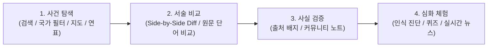

# HistoryDiff 🌍✨

> **국가와 지역에 따른 역사 기술의 차이점("기술 차이")을 텍스트 비교(Diff)를 통해 시각적으로 밝힙니다.**

동일한 역사적 사건이라 할지라도, 교과서에 기술된 내용이나 공식적인 역사 서술은 국가와 지역에 따라 크게 다릅니다. **HistoryDiff**는 이러한 인식의 차이를 텍스트 비교(Diff) 뷰어를 통해 직관적으로 비교하고, 풍부한 배경 분석, 검증 노트(Community Notes), 공신력 있는 참고 출처 및 현대 국제 이슈와의 연결 고리를 함께 제공하는 양방향 교육용 플랫폼입니다.

---

### 다른 언어로 읽기:
🌐 **[English](README.md)** | 🇯🇵 **[日本語](README.ja.md)** | 🇨🇳 **[简体中文](README.zh.md)** | 🇰🇷 **[한국어](README.ko.md)**

---

## 🚀 주요 기능

### 1. 🔍 고도화된 텍스트 비교 뷰어 (Side-by-Side & 인라인 Diff)
* **실시간 나란히 비교:** 국가 및 지역별 역사 교과서 발췌록 또는 공식 서술을 실시간으로 비교하여 추가, 삭제, 어휘 및 표현 차이를 단어/문자 단위로 시각화.
* **단어/문장 단위 원문 Diff 하이라이트 (`ClaimDiffInline`):** 대립되는 핵심 용어(예: '고유 영토' vs '불법 점거')가 포함된 원문 문장을 자동 추출하여 클릭 한 번으로 단어 수준의 인라인 텍스트 Diff를 펼쳐서 대조.
* **스크롤 고정 관점 스위처 (Sticky Switcher) & 모드 전환:** 스크롤 시 상단에 고정되어 비교 대상 국가를 언제든지 즉시 변경 가능. "일반 열람 모드"와 "차이점 비교 모드(좌우 분할 / 단일 행)" 간의 매끄러운 전환 지원.
* **쟁점 키워드 및 고유 어휘 자동 추출:** 각국 교과서에만 등장하는 고유 어휘와 국가별 표현 방식의 대립 쌍을 자동 분석하여 제시.

### 2. ⚡ 메인 페이지 즉시 체험 & 직관적인 탐색 환경
* **실시간 Diff 미니 데모:** 메인 화면 최상단에서 독도(다케시마) 등 주요 쟁점 사건의 다각적 텍스트 Diff를 즉시 전환 및 체험 가능.
* **인식 차이가 가장 큰 역사적 사건 TOP 3:** 세계 각국의 교과서 서술 격차가 가장 두드러진 주요 아카이브를 엄선하여 특집 소개.
* **주요국 핀 고정 필터 (Pinned Country Pills) & 3가지 뷰:** 주요 국가(한국, 일본, 미국, 중국 등) 퀵 필터 캡슐과 전체 드롭다운 셀렉터 제공. 12개 단위 그리드(미니멀 카드), 전 65개 사건이 완전 매핑된 인터랙티브 세계 지도, 다중 연대 전개·해당 연대 전용 주석 필터링 및 연대/카테고리 필터를 갖춘 시계열 연표의 3가지 뷰로 탐색 가능.

### 3. 📰 현대 국제 정세 및 분쟁과의 연결 (Why This Matters Today)
* **"왜 지금 이것이 중요한가":** 과거 역사 교과서 서술의 차이가 오늘날의 외교 갈등 및 지정학적 리스크에 어떤 영향을 미치는지 심층 해설.
* **실시간 뉴스 RSS 피드:** 각 역사적 이슈와 직결된 최신 국제 뉴스를 자동으로 수집하여 실시간 스트리밍.
* **향후 주목 포인트 (Ongoing Watchpoints):** 현재 진행 중인 분쟁 및 논쟁의 시나리오와 관전 포인트를 명시.

### 4. 🛡️ 중립성 보장, 출처 투명성 & 커뮤니티 검증
* **중립성 준수 선언:** 특정 관점을 옹호하거나 비판하지 않고, 각국의 공적 기록을 대등하게 병치하는 편집 원칙 명시.
* **출처 성격 태그 (Source Nature Badges):** 정부 검정 교과서, 공식 성명, 학술 연구, 언론 보도 등 출처의 성격과 원문/번역 언어 상태를 시각적으로 투명하게 표기.
* **커뮤니티 노트 & 유용성 평가 투표:** 객관적인 팩트체크 판정(Verdict)과 1차 사료 링크를 제공하며, 사용자가 "도움이 되었는지"를 평가하는 피드백 투표 시스템 탑재.

### 5. 🎯 인터랙티브 랩 & 역사 인식 진단
* **역사 인식의 '괴리' 진단:** 국가명을 가린 서술문 중 자신이 기억하는 설명과 가장 가까운 것을 선택하여, 나의 인식이 어느 나라 교과서와 일치하는지 블라인드 측정 (SNS 결과 공유 지원).
* **교과서 맞히기 미니 퀴즈:** 독특한 표현이나 서술 어조를 보고 어느 나라 교과서인지 맞히는 4지선다 퀴즈 (연속 정답 스트릭 기능).

### 6. 🌐 다국어 지원 & 이용 가이드
* **4개 국어 완전 로컬라이제이션:** Next.js 국제화 하위 라우트(`/[lang]`) 기반으로 **한국어 (`ko`)**, **영어 (`en`)**, **일본어 (`ja`)**, **중국어 (`zh`)** 4개 국어 완벽 지원.
* **이용 가이드 (`/guide`) & 첫 접속 온보딩:** 프로젝트 비전, 중립성 3대 원칙, 5단계 이용 안내, FAQ를 집약한 가이드 페이지와 첫 방문 웰컴 모달.
* **SEO, 구조화 데이터 & 동적 OGP:** Schema.org 구조화 데이터(`ItemList`, `SearchAction`, `citation`), 동적 `sitemap.xml`/`robots.txt` 및 소셜 공유용 OGP 이미지 자동 생성.

---

## 🛠️ 기술 스택

* **프론트엔드 프레임워크:** Next.js 16.2 (React 19, TypeScript, Turbopack)
* **디자인 & 스타일링:** Vanilla CSS (CSS 변수 기반 디자인 토큰, 글래스모피즘, 반응형 그리드)
* **텍스트 비교 엔진:** `react-diff-viewer-continued` (구문 및 문자 단위 동적 Diff 렌더링)
* **마크다운 파서:** `react-markdown`, `gray-matter` (YAML 프론트매터 메타데이터 파싱 및 리치 텍스트 렌더링)
* **아이콘 라이브러리:** `lucide-react`
* **테스트 스위트:** Node.js 22 내장 테스트 러너 (`node --test`) 기반 제로 디펜던시 초고속 검증
* **OGP 이미지 생성:** Python (`scripts/generate_og_images.py`)
* **번역 파이프라인:** Python (`translate.py`, `translate_ko.py`) + Google 번역 API

---

## 📁 프로젝트 폴더 구조

```bash
historydiff/
├── content/
│   └── events/                   # 역사적 사건 및 서술 논쟁 데이터베이스 (40+ 쟁점 사건)
│       ├── takeshima/            # 예시: 독도(다케시마) 영유권 기술 논쟁
│       │   ├── japan-ja.md       # 일본의 관점 - 일본어 (마스터 원본 소스)
│       │   ├── japan-en.md       # 일본의 관점 - 영어 (자동 번역)
│       │   ├── korea-ko.md       # 한국의 관점 - 한국어
│       │   ├── usa-en.md         # 미국의 관점 - 영어
│       │   ├── notes.json        # 검증 노트 - 일본어 (원본 소스)
│       │   ├── notes-en.json     # 검증 노트 - 영어 (자동 번역)
│       │   └── ...
│       └── ...
├── public/
│   ├── images/                   # 역사 사진 및 사료 이미지
│   └── og/                       # 자동 생성된 소셜 미디어 OGP 미리보기 이미지
├── scripts/
│   └── generate_og_images.py     # OGP 이미지 일괄 생성 스크립트
├── src/
│   ├── app/
│   │   ├── [lang]/               # Next.js 다국어 라우팅
│   │   │   ├── events/[id]/      # 언어별 이벤트 상세 및 비교 페이지
│   │   │   ├── guide/            # 다국어 지원 이용 가이드 페이지
│   │   │   └── page.tsx          # 언어별 검색 및 메인 페이지
│   │   ├── components/           # UI 컴포넌트군
│   │   │   ├── ClaimDiffInline.tsx      # 단어/문장 단위 인라인 Diff 하이라이트
│   │   │   ├── CommunityNotes.tsx       # 주장 사실 확인, 판정, 사료 및 유용성 평가
│   │   │   ├── ControversyKeywords.tsx  # 고유 어휘 및 대립 표현 자동 추출 패널
│   │   │   ├── DiffView.tsx             # 좌우 나란히 보기 / 한 줄 보기 디프 뷰어
│   │   │   ├── FeaturedEvents.tsx       # 쟁점 사건 특집 섹션
│   │   │   ├── Header.tsx / Footer.tsx  # 내비게이션 및 푸터
│   │   │   ├── HistoryQuiz.tsx          # 교과서 맞히기 미니 퀴즈
│   │   │   ├── InteractiveHub.tsx       # 인터랙티브 랩 탭 컨테이너
│   │   │   ├── LanguageSelector.tsx     # 다국어 전환 드롭다운
│   │   │   ├── MapView.tsx              # 인터랙티브 세계 지도 뷰
│   │   │   ├── MiniDiffDemo.tsx         # 메인 페이지 실시간 Diff 데모
│   │   │   ├── NeutralityBanner.tsx     # 중립성 준수 선언 배너
│   │   │   ├── PerceptionDiagnostic.tsx # 역사 인식 괴리 진단기
│   │   │   ├── PhotoGallery.tsx         # 관련 역사 사진 갤러리
│   │   │   ├── PublicVoices.tsx         # 소셜 미디어 여론의 목소리 (주관적 참고 정보)
│   │   │   ├── SearchEvents.tsx         # 주요국 핀 필터, 검색, 아카이브 카탈로그
│   │   │   ├── SourceNatureBadges.tsx   # 출처 성격 및 언어 태그
│   │   │   ├── TimelineView.tsx         # 시계열 연표 뷰
│   │   │   ├── WelcomeModal.tsx         # 첫 방문자 온보딩 모달
│   │   │   └── WhyItMattersSection.tsx  # 현대적 의의, 실시간 뉴스 및 관전 포인트
│   │   ├── guide/                # 루트 가이드 페이지 (영어)
│   │   ├── globals.css           # 글로벌 테마, 디자인 토큰 및 CSS 변수
│   │   ├── layout.tsx            # 전역 공유 레이아웃
│   │   ├── page.tsx              # 전역 루트 페이지
│   │   ├── robots.ts             # 동적 robots.txt
│   │   └── sitemap.ts            # 동적 sitemap.xml
│   └── lib/
│       ├── diffAnalysis.ts       # 고유 어휘 추출 및 대립 표현·괴리도 분석 알고리즘
│       ├── locationCoords.ts     # 지도 시각화용 지리 좌표 데이터베이스 (전 65개 사건 완전 매핑)
│       ├── markdown.ts           # 마크다운 YAML 파서 및 데이터 로더 유틸리티
│       ├── quizData.ts           # 퀴즈 및 진단용 문제 데이터셋
│       ├── schema.ts             # Schema.org 구조화 데이터 생성기
│       ├── sorting.ts            # 연대 정렬 유틸리티
│       ├── sourceNature.ts       # 출처 성격 자동 분류 및 언어 태그 처리
│       ├── timelineUtils.ts      # 다중 연대 전개 및 연대별 주석 필터링 유틸리티
│       └── translations.ts       # 4개 국어 UI 다국어 사전 및 텍스트 리소스
├── tests/                        # 포괄적 단위 및 통합 테스트 스위트
│   ├── content.test.ts           # 마크다운 및 데이터 무결성 검증 테스트
│   ├── diffAnalysis.test.ts      # 텍스트 디프 알고리즘 및 키워드 추출 테스트
│   ├── sorting.test.ts           # 연대 파싱 및 시계열 정렬 테스트
│   ├── sourceNature.test.ts      # 출처 성격 자동 분류 테스트
│   └── translations.test.ts      # 4개 국어 사전 키 동기화 테스트
├── translate.py                  # 일->영, 일->중 자동 번역 스크립트
└── translate_ko.py               # 일->한 자동 번역 스크립트
```

---

## 📖 플랫폼 이용 및 조작 가이드



### 1단계: 사건 검색 및 다각적 뷰 탐색
1. 메인 화면 상단의 **주요국 핀 필터**(‘한국’, ‘일본’, ‘미국’, ‘중국’ 등)를 클릭하거나 드롭다운을 열어 특정 국가 관점의 사건을 필터링합니다.
2. 검색창에 관심 키워드(예: ‘영토’, ‘조약’, ‘냉전’ 등)를 입력하여 실시간으로 검색합니다.
3. **그리드**, **세계 지도**, **연표** 3가지 탭을 전환하며 시각적, 지리적, 시계열적으로 사건을 탐색합니다.

### 2단계: 텍스트 비교 뷰어(Diff)로 2개국 서술 비교
1. 사건 상세 페이지에 접속하면 상단에 **스크롤 고정 관점 스위처**가 표시됩니다.
2. 비교하고자 하는 두 국가를 선택하면 좌우 분할(Side-by-Side) 또는 단일 행(Unified) 모드로 실시간 차이점이 표시됩니다.
3. **'텍스트 쟁점 분석'** 패널에서 AI가 자동 추출한 국가별 '고유 어휘'와 '표현 대립' 목록을 확인합니다.
4. 표현 대립 항목의 **'📖 원문 비교'** 버튼을 클릭하면 해당 문장 간의 단어 단위 Diff 하이라이트가 즉시 펼쳐집니다.

### 3단계: 출처 성격 확인 및 커뮤니티 노트로 사실 검증
1. 각 관점 카드 상단의 **출처 성격 배지**(정부 검정 교과서, 공식 성명, 학술 연구 등)와 원문/번역 언어 상태를 확인합니다.
2. **'커뮤니티 노트'** 섹션에서 핵심 주장의 역사적 배경 맥락, 중립적인 팩트체크 판정(Verdict) 및 공문서, 논문 등 참고 사료를 확인합니다.
3. 검증 내용이 유익했다면 '도움이 되었음' 버튼으로 평가에 참여할 수 있습니다.

### 4단계: 역사 인식 진단, 퀴즈 및 현대 뉴스 연계 확인
1. **'역사 인식 괴리 진단'**을 통해 국가명이 가려진 서술문 중 나의 기억과 가장 가까운 것을 골라, 내 인식이 어느 나라 교과서와 일치하는지 진단해 봅니다.
2. **'교과서 맞히기 미니 퀴즈'**로 서술의 뉘앙스를 파악하는 퀴즈를 풀어봅니다.
3. **'왜 지금 이것이 중요한가'** 섹션과 연동된 실시간 RSS 뉴스를 통해 역사적 서술의 차이가 오늘날 국제 정세에 미치는 영향을 파악합니다.

---

## 📚 데이터 스키마 규칙

개별적인 국가의 역사 기술 서술 파일은 YAML 형식의 프론트매터(Frontmatter)를 갖는 표준 마크다운 문서로 작성됩니다.

```markdown
---
id: "takeshima"
title: "독도(다케시마) 영유권 서술 비교"
category: "영토 문제·주권"
year: "17세기-현재"
location: "동해 (일본해)"
country: "한국"
language: "ko"
source: "대한민국 교육부 검정 역사 교과서 / 외교부 공식 견해"
---

여기에 구체적인 역사적 기술 및 발췌 문장을 기입합니다.
표준 마크다운 문법을 그대로 사용할 수 있습니다.
```

### 사실 검증 정보 데이터 형식 (`notes.json`)

```json
{
  "eventId": "takeshima",
  "notes": [
    {
      "id": "takeshima-claim-1",
      "claim": "사실 검증의 대상이 되는 핵심 서술이나 주장",
      "context": "해당 진술이 어떤 맥락에서 역사적으로 쟁점이 되는지에 관한 배경 정보",
      "verdict": "중립적이고 역사 학술적 합의에 기초한 팩트체크 판정 결과 및 요약",
      "sources": [
        {
          "title": "참고 도서 또는 사료 명칭",
          "url": "https://example.com/source",
          "publisher": "출판사, 정부 부처 또는 학회 포털",
          "type": "academic"
        }
      ]
    }
  ]
}
```

---

## 🤖 번역 파이프라인 & OGP 생성 자동화

다국어 데이터 유지를 단순화하기 위해 **일본어 데이터를 모든 역사 정보의 표준 원본(Master Source)**으로 활용하며, Python 스크립트로 번역 동기화 및 소셜 카드를 일괄 생성합니다.

### 스크립트 실행 명령어:
```bash
# 1. 일본어 원본 소스를 영어와 중국어 버전으로 번역 및 생성
python3 translate.py

# 2. 일본어 원본 소스를 한국어 버전으로 번역 및 생성 (특정 이벤트 대상)
python3 translate_ko.py

# 3. 전체 이벤트 및 메인 페이지의 동적 OGP 이미지 일괄 생성
python3 scripts/generate_og_images.py
```

---

## 💻 로컬 개발 환경 실행 방법

### 1. 사전 준비 환경
- **Node.js**: `v18.0.0` 또는 그 이상 (Node.js 22 권장)
- **패키지 매니저**: npm / pnpm / yarn / bun
- **Python 3**: (선택 사항: 번역 스크립트 구동 또는 OGP 이미지 생성 시 필요)

### 2. 패키지 설치
```bash
npm install
```

### 3. 개발 서버 구동
```bash
npm run dev
```
인터넷 브라우저에서 [http://localhost:3000](http://localhost:3000)을 열어 확인합니다.

### 4. 테스트 실행
Node.js 22 내장 테스트 러너 기반의 제로 디펜던시 테스트를 실행합니다:
```bash
npm test
```

### 5. 프로덕션 패키지 빌드
```bash
npm run build
```

---

## 🤝 기여 안내 및 중립성 준수 규정

HistoryDiff는 비판적 사고, 미디어 리터러시, 세계사적 안목을 넓히기 위한 순수 교육용 플랫폼입니다. 특정 국가나 관점의 주장을 비호하거나 정치적인 스탠스를 대변하지 않으며, **"동일한 역사적 사실이 입장과 맥락에 따라 얼마나 다르게 표현되고 전달될 수 있는가"**를 있는 그대로 객관적으로 전개하는 데 집중합니다.

새로운 사실 검증 기록의 보강, 표현의 적확한 수정, 양질의 학술 서적 추천과 같은 전 세계 커뮤니티의 건설적인 기여를 따뜻하게 기다립니다!

---

## 📄 라이선스 규정

이 레포지토리 내의 코드 및 콘텐츠 자산은 비공개 독점 자산(Private & Proprietary)으로 정의됩니다. 상업적 유포나 무단 복제를 엄격히 제한합니다.

