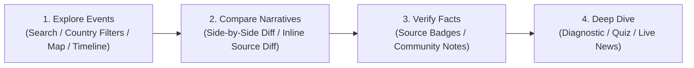

# HistoryDiff 🌍✨

> **Visually unravelling the "differences in descriptions" of history across different countries and regions.**

Even for the same historical event, textbook descriptions and official narratives vary significantly depending on the country or region. **HistoryDiff** is an interactive educational web platform that highlights these differences in perception through side-by-side text comparisons (Diffs), accompanied by structured verification notes, credible references, and real-time connections to contemporary world events.

---

### Read this in other languages:
🌐 **[English](README.md)** | 🇯🇵 **[日本語](README.ja.md)** | 🇨🇳 **[简体中文](README.zh.md)** | 🇰🇷 **[한국어](README.ko.md)**

---

## 🚀 Key Features

### 1. 🔍 Advanced Text Diff Viewer (Side-by-Side & Inline Diff)
* **Real-Time Comparison:** Compares textbook excerpts or official historical narratives from different countries/regions in real-time, highlighting additions, deletions, and phrasing differences at word/character precision.
* **Word/Sentence-Level Inline Source Diff (`ClaimDiffInline`):** Automatically extracts source sentences containing contrasting key terms (e.g., "Inherent Territory" vs. "Illegal Occupation") and renders inline word-level diffs with a single click ("📖 Compare Sources").
* **Sticky Perspective Switcher & Mode Toggle:** Sticky header allows switching compared countries on the fly while scrolling. Seamlessly toggle between "Read Mode" and "Diff Mode (Split / Unified)".
* **Automated Controversy Analysis:** Identifies exclusive keywords unique to each country's narrative and presents key terminology contrasts side-by-side.

### 2. ⚡ Instant Experience & Streamlined Discovery
* **Interactive Live Mini Diff Demo:** Instantly explore multilateral diffs for landmark events (such as Takeshima / Dokdo) right on the homepage hero section.
* **Featured Controversies TOP 3:** Highlights historical events with the sharpest global perception divergences.
* **Pinned Country Pills & Multi-View Exploration:** Quick-filter by major countries (Japan, USA, China, Korea, etc.) via pills and a full dropdown. Browse the catalog across Grid (minimalist cards), Interactive World Map, and Chronological Timeline views.

### 3. 📰 Connecting History to Modern Geopolitics (Why This Matters Today)
* **"Why This Matters Today":** In-depth analysis explaining how historical disputes directly fuel current diplomatic tensions and international crises.
* **Live News RSS Feed:** Live feed streaming breaking international news related to each historical event.
* **Ongoing Watchpoints:** Scenarios, upcoming outlooks, and key developments to follow.

### 4. 🛡️ Neutrality, Transparency & Community Verification
* **Neutrality Commitment:** Clear editorial policy treating all official perspectives with equal standing without taking sides.
* **Source Nature Badges:** Categorizes sources as "Authorized Textbook," "Government Statement," "Academic Research," or "Media Report," indicating whether the text is original language or translated.
* **Community Notes & Helpfulness Ratings:** Fact-based analysis with primary sources and a community feedback system ("Was this note helpful?").

### 5. 🎯 Interactive Lab & Perception Diagnostic
* **Historical Perception & Bias Diagnostic:** Blind test that diagnoses which country's textbook description matches your learned memory, showing perception gaps against global textbooks (with social sharing).
* **"Guess the Textbook" Mini Quiz:** 4-choice quiz testing your intuition to identify the authoring nation from distinctive phrasing and tone (includes streak tracking).

### 6. 🌐 Multilingual Localization & Walkthrough Guide
* **4-Language Localization:** Built with Next.js internationalized sub-routing (`/[lang]`) in **English (`en`)**, **Japanese (`ja`)**, **Chinese (`zh`)**, and **Korean (`ko`)**.
* **Usage Guide (`/guide`) & First-Time Onboarding:** Dedicated page detailing platform principles, neutrality commitments, 5-step walkthrough, FAQ, and a welcome onboarding modal.
* **SEO, Structured Data & Dynamic OGP:** Schema.org structured data (`ItemList`, `SearchAction`, `citation`), dynamic `sitemap.xml`/`robots.txt`, and automated OGP image generation.

---

## 🛠️ Technology Stack

* **Frontend:** Next.js 16.2 (React 19, TypeScript, Turbopack)
* **Styling & Design:** Vanilla CSS (CSS Variables design tokens, glassmorphism, responsive grids)
* **Diff Engine:** `react-diff-viewer-continued` (syntax & character-level diff rendering)
* **Markdown & Parsing:** `react-markdown`, `gray-matter` (YAML frontmatter parsing and rich text)
* **Icons:** `lucide-react`
* **Test Suite:** Node.js 22 built-in test runner (`node --test`) for fast, zero-dependency testing
* **OGP Generation:** Python (`scripts/generate_og_images.py`)
* **Translation Pipeline:** Python (`translate.py`, `translate_ko.py`) + Google Translate API

---

## 📁 Project Structure

```bash
historydiff/
├── content/
│   └── events/                   # Database of historical events and controversies (40+ events)
│       ├── takeshima/            # Example: Takeshima / Dokdo controversy
│       │   ├── japan-ja.md       # Japanese perspective in Japanese (Master Source)
│       │   ├── japan-en.md       # Japanese perspective in English (Auto-translated)
│       │   ├── korea-ko.md       # Korean perspective in Korean
│       │   ├── usa-en.md         # USA perspective in English
│       │   ├── notes.json        # Verification notes in Japanese (Source)
│       │   ├── notes-en.json     # Verification notes in English (Auto-translated)
│       │   └── ...
│       └── ...
├── public/
│   ├── images/                   # Historical photographs and archival media
│   └── og/                       # Generated dynamic OGP images
├── scripts/
│   └── generate_og_images.py     # Batch OGP image generation script
├── src/
│   ├── app/
│   │   ├── [lang]/               # Next.js internationalized routing
│   │   │   ├── events/[id]/      # Localized event detail & comparison pages
│   │   │   ├── guide/            # Localized guide & walkthrough page
│   │   │   └── page.tsx          # Localized home search page
│   │   ├── components/           # Reusable UI components
│   │   │   ├── ClaimDiffInline.tsx      # Word/sentence-level inline diff highlights
│   │   │   ├── CommunityNotes.tsx       # Claims, verdicts, citations & helpfulness voting
│   │   │   ├── ControversyKeywords.tsx  # Exclusive terms and phrasing contrasts panel
│   │   │   ├── DiffView.tsx             # Side-by-side / Unified diff viewer
│   │   │   ├── FeaturedEvents.tsx       # Top controversies feature section
│   │   │   ├── Header.tsx / Footer.tsx  # Header navigation and footer
│   │   │   ├── HistoryQuiz.tsx          # "Guess the Textbook" interactive quiz
│   │   │   ├── InteractiveHub.tsx       # Tabbed lab container (Quiz / Diagnostic)
│   │   │   ├── LanguageSelector.tsx     # Dropdown language switcher
│   │   │   ├── MapView.tsx              # Interactive world map view
│   │   │   ├── MiniDiffDemo.tsx         # Real-time hero mini diff demo
│   │   │   ├── NeutralityBanner.tsx     # Neutrality commitment banner
│   │   │   ├── PerceptionDiagnostic.tsx # Historical bias & perception diagnostic
│   │   │   ├── PhotoGallery.tsx         # Historical photo gallery
│   │   │   ├── PublicVoices.tsx         # Social media public voices (subjective reference)
│   │   │   ├── SearchEvents.tsx         # Pinned country filter, search, faceted catalog
│   │   │   ├── SourceNatureBadges.tsx   # Source nature classification & language tags
│   │   │   ├── TimelineView.tsx         # Chronological timeline view
│   │   │   ├── WelcomeModal.tsx         # First-time visitor onboarding modal
│   │   │   └── WhyItMattersSection.tsx  # Modern context, live news, and watchpoints
│   │   ├── guide/                # Root guide & walkthrough page (English)
│   │   ├── globals.css           # Design tokens, CSS variables, and themes
│   │   ├── layout.tsx            # Root layout
│   │   ├── page.tsx              # Root page (defaults to English)
│   │   ├── robots.ts             # Dynamic robots.txt
│   │   └── sitemap.ts            # Dynamic sitemap.xml
│   └── lib/
│       ├── diffAnalysis.ts       # Exclusive keywords and controversy analysis algorithms
│       ├── locationCoords.ts     # Geo-coordinates database for map visualization
│       ├── markdown.ts           # Markdown parsing utilities and file loaders
│       ├── quizData.ts           # Question datasets for quizzes and diagnostics
│       ├── schema.ts             # Schema.org structured data generators
│       ├── sourceNature.ts       # Source classification and language badge utilities
│       └── translations.ts       # Multilingual dictionaries for global UI strings
├── tests/                        # Comprehensive unit & integration test suite
│   ├── content.test.ts           # Markdown & dataset integrity tests
│   ├── diffAnalysis.test.ts      # Diff algorithm & keyword extraction tests
│   ├── sorting.test.ts           # Era & chronological parsing tests
│   ├── sourceNature.test.ts      # Source classification tests
│   └── translations.test.ts      # 4-language key parity & consistency tests
├── translate.py                  # Translates content from Japanese to English and Chinese
└── translate_ko.py               # Translates content from Japanese to Korean
```

---

## 📖 Step-by-Step User Guide



### Step 1: Explore & Filter Events
1. Click any **Pinned Country Pill** on the homepage ("Japan", "USA", "China", "Korea", etc.) or use the dropdown to filter events.
2. Type queries (e.g., "territory", "treaty", "Cold War") in the search bar for instant filtering.
3. Switch between **Grid**, **World Map**, and **Timeline** tabs to explore events visually, geographically, and chronologically.

### Step 2: Inspect Side-by-Side Diffs
1. On the event page, use the **Sticky Perspective Switcher** to select two countries.
2. Toggle between Split (Side-by-Side) and Unified (Inline) modes to inspect additions, omissions, and phrasing shifts.
3. In the **"Text Controversy Analysis"** panel, click **"📖 Compare Sources"** next to any contrasting term to expand word-level source sentence diffs.

### Step 3: Check Source Nature & Community Notes
1. Review the **Source Nature Badges** on each perspective card (e.g., Authorized Textbook, Government Statement, Academic Research) and language status.
2. Inspect the **Community Notes** section for balanced historical context, fact check verdicts, and primary source citations.
3. Cast your vote on whether the note was helpful to foster community feedback.

### Step 4: Interactive Lab & Breaking News
1. Take the **Perception Diagnostic** to discover which national curriculum aligns with your historical memory.
2. Test your knowledge in the **"Guess the Textbook" Mini Quiz**.
3. Read the **"Why This Matters Today"** section and browse live RSS news feeds to see how past narratives influence modern conflicts.

---

## 📚 Content Schema

Each perspective is defined as a Markdown file with a YAML frontmatter header containing localized metadata attributes:

```markdown
---
id: "takeshima"
title: "Description of the Sovereignty of Takeshima (Dokdo)"
category: "Sovereignty & Territory"
year: "17th Century - Present"
location: "Sea of Japan (East Sea)"
country: "Japan"
language: "en"
source: "Ministry of Education Authorized Textbook / Ministry of Foreign Affairs"
---

The actual description of historical events goes here. 
You can use standard Markdown formatting.
```

### Verification Notes Schema (`notes.json`)

Notes are structured to provide factual balance and context:

```json
{
  "eventId": "takeshima",
  "notes": [
    {
      "id": "takeshima-claim-1",
      "claim": "Claim to be verified.",
      "context": "Contextual background explaining why this is controversial.",
      "verdict": "Neutral verification analysis and consensus.",
      "sources": [
        {
          "title": "Document Title",
          "url": "https://example.com/source",
          "publisher": "Academic Publisher or Government Department",
          "type": "academic"
        }
      ]
    }
  ]
}
```

---

## 🤖 Content Translation & OGP Generation Pipeline

To streamline content updates, Japanese is used as the **master source** for content and notes. The included Python scripts translate and sync content into the remaining languages.

### Available Scripts:
```bash
# 1. Translate all Japanese content to English and Chinese
python3 translate.py

# 2. Translate Japanese content to Korean for selected events
python3 translate_ko.py

# 3. Generate dynamic OGP social preview images for all events and home pages
python3 scripts/generate_og_images.py
```

---

## 💻 Getting Started

### 1. Prerequisites
- **Node.js**: `v18.0.0` or higher (Node.js 22 recommended)
- **npm** or similar package manager (pnpm, yarn, bun)
- **Python 3** (Optional: for translation pipeline and OGP image generation)

### 2. Installation
```bash
npm install
```

### 3. Development Server
```bash
npm run dev
```
Open [http://localhost:3000](http://localhost:3000) in your browser.

### 4. Running Tests
Run the zero-dependency test suite powered by Node.js 22 built-in test runner:
```bash
npm test
```

### 5. Production Build
```bash
npm run build
```

---

## 🤝 Contribution & Neutrality Statement

HistoryDiff is an educational platform designed to encourage critical thinking, media literacy, and global perspective awareness. It does not take a stance on any geopolitical issues but aims to show how the same history can be viewed, taught, and recorded through different lenses. 

Contributions that add verified regional perspectives, fix translation nuances, or add credible academic sources are always welcome!

---

## 📄 License

This project is private and proprietary. All rights reserved.

