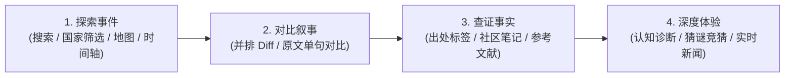

# HistoryDiff 🌍✨

> **通过文本对比（Diff）直观呈现不同国家和地区对同一历史事件的“记述差异”。**

即使是同一个历史事件，不同国家或地区的教科书内容以及官方叙事也会有很大差异。**HistoryDiff** 是一个交互式教育平台，旨在通过并排文本对比（Diff）凸显这些认知上的差异，并提供详细的背景解析、事实核查笔记（Community Notes）、权威参考文献，以及与当代国际新闻热点的实时连接。

---

### 阅读其他语言版本：
🌐 **[English](README.md)** | 🇯🇵 **[日本語](README.ja.md)** | 🇨🇳 **[简体中文](README.zh.md)** | 🇰🇷 **[한국어](README.ko.md)**

---

## 🚀 主要功能

### 1. 🔍 高级文本差异对比引擎（Side-by-Side & 行内 Diff）
* **实时并排对比：** 并排对比不同国家/地区的教科书或官方声明，直观在词句和字符级别高亮“添加”、“删除”与“措辞差异”。
* **词句级原文Diff高亮（`ClaimDiffInline`）：** 自动提取包含争议对立词（例如“固有领土” vs “非法占领”）的原文句子，点击“📖 对比原文”即可一键展开单句级别的词汇Diff。
* **吸顶视角切换栏（Sticky Switcher）与模式切换：** 滚动页面时常驻顶部，支持随时快速切换对比国家，并在“普通阅读模式”与“差异对比模式（分栏 / 统一行）”间自由切换。
* **争议词与独有词自动提取分析：** 自动识别仅存在于某一国家教科书中的“独有词汇”，并直观对比各方“表述对立”。

### 2. ⚡ 首页即时体验与现代化探索交互
* **实时Diff迷你演示：** 首页首屏即可即时切换并体验独岛（竹岛）等多视角的文本Diff对比。
* **认知分歧最大的历史事件 TOP 3：** 专区展示全球认知背离度最高的焦点事件。
* **置顶国家筛选胶囊（Pinned Country Pills）与多维视图：** 一键筛选主要国家（日本、美国、中国、韩国等）及完整下拉列表。支持每页12项的网格（精简卡片）、覆盖全部65个事件的交互式世界地图、以及支持多年代展开、严格年代注释过滤和年代/分类筛选的时序时间轴三种视图。

### 3. 📰 连通当代国际地缘政治（Why This Matters Today）
* **“为什么现在这很重要”：** 深入解析历史教科书争议如何直接影响当下的外交博弈与地缘危机。
* **实时新闻 RSS 资讯流：** 自动获取并展示与该历史议题相关的最新国际新闻。
* **后续观察焦点（Ongoing Watchpoints）：** 梳理进行中冲突的未来情景与关键动向。

### 4. 🛡️ 事实核查、中立性准则与社区反馈
* **中立性声明：** 秉持客观中立原则，平等并置各方观点，不偏袒或攻击任何特定历史叙事。
* **文献性质标签（Source Nature Badges）：** 明确标注文献类型（政府审定教科书、官方声明、学术研究、公定媒体等）及原典语言/翻译状态。
* **社区笔记与有用度评分：** 提供中立核查结论（Verdict）与权威参考文献链接，并支持用户进行“是否有帮助”的评价投票。

### 5. 🎯 互动实验室与历史认知诊断
* **历史认知“偏差”诊断：** 盲测选择与自己记忆最接近的无国名描述，测试自身历史认知与哪国教科书一致，并展示与全球教科书的认知鸿沟（支持分享至社交网络）。
* **“根据记述猜国家”竞猜游戏：** 根据特色措辞和论调猜测教科书所属国家的趣味 4 选 1 答题（含连胜纪录）。

### 6. 🌐 多语言国际化与使用指南
* **4 种语言完整本地化：** 采用 Next.js 国际化子路由（`/[lang]`），全面支持 **中文 (`zh`)**、**英文 (`en`)**、**日文 (`ja`)**、**韩文 (`ko`)**。
* **使用指南（`/guide`）与初次访问引导：** 包含平台理念、中立性三原则、5步使用指南、FAQ 以及新手欢迎引导弹窗。
* **SEO、结构化数据与动态 OGP：** Schema.org 结构化数据（`ItemList`, `SearchAction`, `citation` 等）、动态 `sitemap.xml`/`robots.txt`，以及全量社交分享 OGP 图像自动生成。

---

## 🛠️ 技术栈

* **前端框架：** Next.js 16.2 (React 19, TypeScript, Turbopack)
* **样式与设计：** 原生 Vanilla CSS（基于 CSS 变量的设计系统，毛玻璃效果，响应式网格）
* **差异对比引擎：** `react-diff-viewer-continued`（词句/字符级动态 Diff 渲染）
* **Markdown 解析：** `react-markdown`, `gray-matter`（YAML Frontmatter 元数据解析与富文本渲染）
* **图标库：** `lucide-react`
* **测试套件：** Node.js 22 内置测试运行器（`node --test`）提供零依赖极速测试
* **OGP 图像生成：** Python (`scripts/generate_og_images.py`)
* **翻译工作流：** Python (`translate.py`, `translate_ko.py`) + Google 翻译 API

---

## 📁 项目目录结构

```bash
historydiff/
├── content/
│   └── events/                   # 历史事件与争议数据库（40+ 核心事件）
│       ├── takeshima/            # 示例：独岛（竹岛）主权记述争议
│       │   ├── japan-ja.md       # 日本视角 - 日语 (主数据源)
│       │   ├── japan-en.md       # 日本视角 - 英语 (自动翻译)
│       │   ├── korea-ko.md       # 韩国视角 - 韩语
│       │   ├── usa-en.md         # 美国视角 - 英语
│       │   ├── notes.json        # 验证笔记 - 日语 (原始源文件)
│       │   ├── notes-en.json     # 验证笔记 - 英语 (自动翻译)
│       │   └── ...
│       └── ...
├── public/
│   ├── images/                   # 历史照片与文献影像
│   └── og/                       # 自动生成的社交媒体 OGP 预览图
├── scripts/
│   └── generate_og_images.py     # OGP 图像批量生成脚本
├── src/
│   ├── app/
│   │   ├── [lang]/               # Next.js 国际化路由
│   │   │   ├── events/[id]/      # 各语言事件详情与对比页
│   │   │   ├── guide/            # 多语言使用指南页
│   │   │   └── page.tsx          # 各语言检索首页
│   │   ├── components/           # UI 组件库
│   │   │   ├── ClaimDiffInline.tsx      # 词句级行内 Diff 高亮组件
│   │   │   ├── CommunityNotes.tsx       # 事实核查、结论、文献与投票
│   │   │   ├── ControversyKeywords.tsx  # 独有词与对立表述自动提取面板
│   │   │   ├── DiffView.tsx             # 分栏/单栏差异对比渲染器
│   │   │   ├── FeaturedEvents.tsx       # 焦点争议事件专区
│   │   │   ├── Header.tsx / Footer.tsx  # 导航与页脚
│   │   │   ├── HistoryQuiz.tsx          # 猜教科书趣味竞猜
│   │   │   ├── InteractiveHub.tsx       # 互动实验室选项卡容器
│   │   │   ├── LanguageSelector.tsx     # 语言切换下拉菜单
│   │   │   ├── MapView.tsx              # 交互式世界地图视图
│   │   │   ├── MiniDiffDemo.tsx         # 首页即时 Diff 演示
│   │   │   ├── NeutralityBanner.tsx     # 中立性声明横幅
│   │   │   ├── PerceptionDiagnostic.tsx # 历史认知偏差诊断
│   │   │   ├── PhotoGallery.tsx         # 历史照片画廊
│   │   │   ├── PublicVoices.tsx         # 网络社媒舆论（主观参考信息）
│   │   │   ├── SearchEvents.tsx         # 置顶国家筛选、搜索与分类列表
│   │   │   ├── SourceNatureBadges.tsx   # 出处性质与语言标签
│   │   │   ├── TimelineView.tsx         # 历史时序时间轴视图
│   │   │   ├── WelcomeModal.tsx         # 初次访问欢迎引导弹窗
│   │   │   └── WhyItMattersSection.tsx  # 当代关联、实时新闻与观察点
│   │   ├── guide/                # 根目录使用指南（英语）
│   │   ├── globals.css           # 全局样式系统、主题与 CSS 变量
│   │   ├── layout.tsx            # 全局布局
│   │   ├── page.tsx              # 根目录首页
│   │   ├── robots.ts             # 动态 robots.txt
│   │   └── sitemap.ts            # 动态 sitemap.xml
│   └── lib/
│       ├── diffAnalysis.ts       # 专属词提取与背离度分析算法
│       ├── locationCoords.ts     # 地图可视化经纬度数据（全65个事件完整映射）
│       ├── markdown.ts           # Markdown 及 JSON 解析工具
│       ├── quizData.ts           # 竞猜与认知诊断题库
│       ├── schema.ts             # Schema.org 结构化数据生成
│       ├── sorting.ts            # 年代排序实用工具
│       ├── sourceNature.ts       # 出处性质判定与语言标签工具
│       ├── timelineUtils.ts      # 多年代展开与年代专属注释筛选实用工具
│       └── translations.ts       # 4国语言全球化文本字典
├── tests/                        # 完备的单元与集成测试套件
│   ├── content.test.ts           # 历史文献与数据集完整性测试
│   ├── diffAnalysis.test.ts      # 差异算法与对立词提取测试
│   ├── sorting.test.ts           # 年代解析与时序排序测试
│   ├── sourceNature.test.ts      # 出处性质判定测试
│   └── translations.test.ts      # 4 种语言键值一致性测试
├── translate.py                  # 日语内容翻译为英语和中文的脚本
└── translate_ko.py               # 日语内容翻译为韩语的脚本
```

---

## 📖 平台使用与操作指南



### 第 1 步：检索事件并切换多维视图
1. 点击首页顶部的**置顶国家筛选胶囊**（“日本”、“美国”、“中国”、“韩国”等）或使用下拉菜单进行快速筛选。
2. 在搜索框中输入关键字（如“领土”、“条约”、“冷战”等）即可实时过滤。
3. 自由切换**网格**、**世界地图**和**时间轴**三种视图，从视觉、地理与时间多角度探索感兴趣的历史争端。

### 第 2 步：使用文本差异对比器（Diff）比较记述
1. 进入事件详情页，页面顶部提供**吸顶视角切换栏**，随时选择需要对比的两个国家。
2. 可在左右分栏（Side-by-Side）和统一单栏（Unified）间切换，直观查看增删与修辞变动。
3. 在**“争议文本分析”**面板中，点击对立词旁的 **“📖 对比原文”** 按钮，即可就地展开对应原文句子的词级 Diff 高亮。

### 第 3 步：确认文献性质，阅读社区事实核查
1. 查看各视角卡片顶部的**文献性质标签**（如政府审定教材、官方见解、学术专著等）及原典语言状态。
2. 在**“社区笔记”**中查阅争议主张的背景解析、中立事实核查结论（Verdict）以及公文档案与论文等参考文献。
3. 如果笔记对你有启发，可点击“是否有帮助”参与评价反馈。

### 第 4 步：参与认知诊断、竞猜游戏并关注当代新闻
1. 进行**“历史认知偏差诊断”**，在盲测中了解自己的历史记忆与哪国教材最吻合。
2. 挑战**“根据记述猜国家”竞猜游戏**，考察自己对不同教科书修辞风格的敏锐度。
3. 阅读**“为什么现在这很重要”**板块并浏览关联的实时新闻 RSS，洞察历史争端在当代地缘政治中的延续。

---

## 📚 内容数据结构

每个视角的文本文件都是一个包含 YAML 前言（Frontmatter）的 Markdown 文件：

```markdown
---
id: "takeshima"
title: "关于独岛（竹岛）主权记述争议"
category: "领土与主权"
year: "17世纪-至今"
location: "日本海（东海）"
country: "日本"
language: "zh"
source: "日本文部科学省审定教科书 / 外务省官方见解"
---

此处为具体的历史记述正文。
支持标准的 Markdown 格式。
```

### 事实核查笔记数据结构 (`notes.json`)

```json
{
  "eventId": "takeshima",
  "notes": [
    {
      "id": "takeshima-claim-1",
      "claim": "需要被核查的具体历史主张",
      "context": "该主张为何存在争议的历史背景分析",
      "verdict": "基于中立历史视角的ファクトチェック（事实核查）结论",
      "sources": [
        {
          "title": "文献、论文或档案标题",
          "url": "https://example.com/source",
          "publisher": "发布机构、学报或政府部门",
          "type": "academic"
        }
      ]
    }
  ]
}
```

---

## 🤖 自动化内容翻译与 OGP 生成工作流

所有内容及核查笔记均以**日语作为主数据源（Master Source）**，通过 Python 脚本自动翻译同步至其他语言版本并生成社交卡片图。

### 脚本命令：
```bash
# 1. 将日语源文件自动翻译为英语和中文版本
python3 translate.py

# 2. 将日语源文件自动翻译为韩语版本 (针对特定事件)
python3 translate_ko.py

# 3. 批量生成全量事件及首页的动态 OGP 社交分享图
python3 scripts/generate_og_images.py
```

---

## 💻 本地开发指南

### 1. 前置条件
- **Node.js**: `v18.0.0` 或更高版本（推荐 Node.js 22）
- **包管理器**: npm / pnpm / yarn / bun
- **Python 3**（可选，仅在执行翻译或生成 OGP 时需要）

### 2. 安装依赖
```bash
npm install
```

### 3. 运行本地开发服务器
```bash
npm run dev
```
在浏览器中打开 [http://localhost:3000](http://localhost:3000) 即可查看。

### 4. 运行自动化测试
执行基于 Node.js 22 内置测试运行器的零依赖测试：
```bash
npm test
```

### 5. 生成生产构建
```bash
npm run build
```

---

## 🤝 贡献与中立性声明

HistoryDiff 作为一个教育性质的项目，旨在培养批判性思维、媒介素养以及全球多元历史视角。本平台不代表任何特定政治立场或地缘主权倾向，其唯一目的是客观展示**“同一段历史如何因立场、地区的不同而被赋予截然不同的记述与解读”**。

非常欢迎社区向我们贡献事实核查笔记、校准翻译细微差异或补充更为权威的学术文献参考！

---

## 📄 许可协议

本项目为私有专有资产（Private & Proprietary）。保留所有权利。
